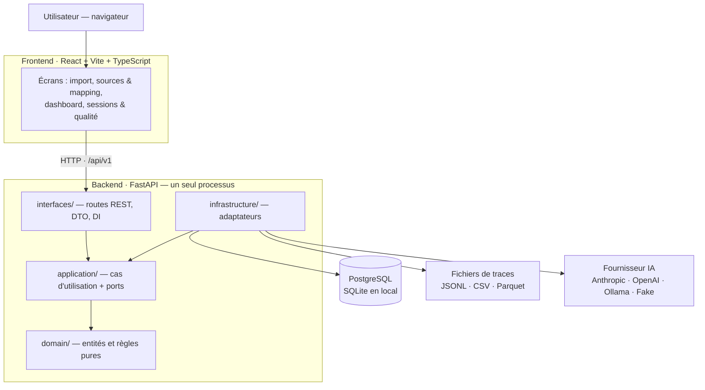
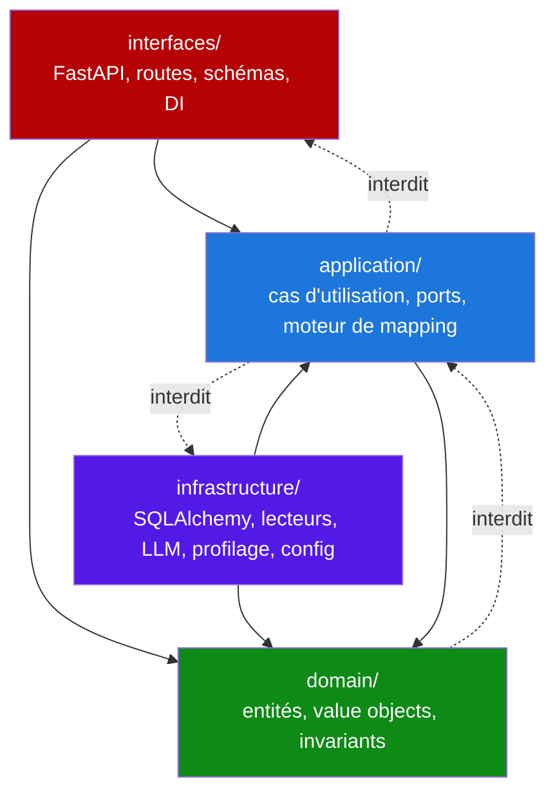
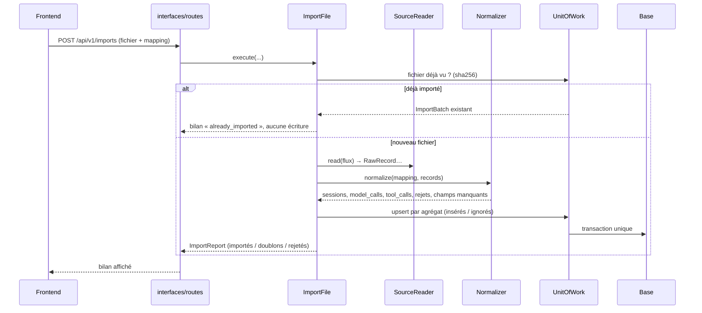

# Architecture — composants et dépendances

Ce document décrit **ce qui existe dans le dépôt** : les composants, ce dont chacun a le droit de
dépendre, et comment étendre le système sans casser la règle des dépendances.

Les décisions qui ont mené à cette structure sont dans [`adr/`](adr/) — en particulier
[ADR-0002](adr/0002-monolithe-modulaire-clean-architecture.md). Le découpage des tâches est dans
[`../PLAN.md`](../PLAN.md).

---

## 1. Vue d'ensemble

Une seule application déployable — un **monolithe modulaire** — plus un frontend statique.



Points à retenir :

- Le **cœur métier** — `domain/` et `application/` — ne connaît ni FastAPI, ni SQLAlchemy, ni un
  SDK d'IA. Il déclare des **ports** ; l'infrastructure fournit les implémentations.
- Le frontend ne parle qu'à l'API REST, préfixée **`/api/v1`**.
- Le fournisseur d'IA est choisi **par configuration** — jamais par un `import` dans le code métier
  ([ADR-0005](adr/0005-abstraction-ia.md)).

---

## 2. Le sens des dépendances

La règle tient en une phrase : **les dépendances vont vers l'intérieur, jamais l'inverse.**



| Couche | Chemin | Rôle | A le droit d'importer |
| --- | --- | --- | --- |
| **Domaine** | `backend/agentscope/domain/` | entités, value objects, invariants, politiques de rétention | **rien** (stdlib seulement) |
| **Application** | `backend/agentscope/application/` | cas d'utilisation, **ports** (interfaces), moteur de mapping | `domain` |
| **Infrastructure** | `backend/agentscope/infrastructure/` | implémentations concrètes des ports | `application`, `domain` |
| **Interfaces** | `backend/agentscope/interfaces/` | API REST, DTO, injection de dépendances | `application`, `domain` |

### La règle est vérifiée automatiquement

`import-linter` la contrôle à chaque exécution — `make arch` en local, et
`backend/tests/unit/test_architecture.py` dans la suite `pytest`. Les cinq contrats déclarés dans
`backend/pyproject.toml` :

| # | Contrat | Ce qu'il empêche |
| --- | --- | --- |
| 1 | Sens des dépendances entre couches | `domain` qui importerait `application`, `application` qui importerait `infrastructure`… |
| 2 | Le domaine ne dépend d'aucun framework ni SDK | `pydantic`, `sqlalchemy`, `fastapi`, `pandas`, `anthropic`… dans `domain` |
| 3 | Les cas d'utilisation ne dépendent d'aucun framework ni SDK | la même liste dans `application` — les use cases parlent aux ports |
| 4 | Seul le point de composition connaît l'infrastructure | une route ou un schéma qui instancierait un adaptateur |
| 5 | Les adaptateurs d'infrastructure sont indépendants entre eux | un lecteur de fichier qui appellerait la base, un adaptateur LLM qui appellerait un lecteur |

Une PR qui casse un de ces contrats échoue : c'est le garde-fou de l'architecture, pas une
convention orale.

---

## 3. Détail des composants

### 3.1 `domain/` — le cœur

Dataclasses gelées (`frozen=True, slots=True`), aucune dépendance externe, aucune I/O.

| Module | Contenu |
| --- | --- |
| `entities.py` | `Source`, `Repository`, `RawRecord`, `ImportBatch`, `ImportReject`, `Session`, `ModelCall`, `ToolCall`, `SourceMapping`, `FieldProfile`, `FieldProfileSet` |
| `value_objects.py` | `Provenance`, `Interval`, `TokenUsage`, et les énumérations `FileFormat`, `ImportStatus`, `CallStatus`, `ErrorType`, `RejectReason` |
| `retention.py` | `RetentionMode`, `RetentionPolicy` — que garde-t-on du brut ([ADR-0006](adr/0006-provenance.md)) |
| `_invariants.py` | vérifications partagées appelées dans les `__post_init__` |
| `errors.py` | `DomainError`, `InvariantViolationError`, `InvalidMappingError` |

Une entité invalide **ne peut pas exister** : les invariants sont vérifiés à la construction.

### 3.2 `application/` — cas d'utilisation et ports

**Ports** (`application/ports/`) — des `Protocol` que l'infrastructure implémente :

| Port | Rôle | Implémentation actuelle |
| --- | --- | --- |
| `SourceReader` | lire un fichier et produire des `RawRecord` | `JsonlReader`, `CsvReader`, `ParquetReader` |
| `FieldProfiler` · `SensitiveFilter` | profiler des champs inconnus · masquer avant échantillonnage | `DefaultFieldProfiler` |
| `LLMProvider` | `propose_mapping`, `chat` → `MappingProposal`, `ChatReply` | `FakeLLMProvider` |
| `ReferenceRepository`, `MappingRepository`, `ImportRepository`, `RawRecordRepository`, `SessionRepository`, `ModelCallRepository`, `ToolCallRepository`, `RejectRepository`, `FieldProfileRepository` | persistance par agrégat, avec `UpsertOutcome` (insérés / ignorés) | `Sql*Repository` |
| `UnitOfWork` | une transaction, tous les dépôts, `commit` / `rollback` | `SqlAlchemyUnitOfWork` |
| `ProvenanceRepository` | remonter d'une ligne normalisée à son `raw_record` | `SqlProvenanceRepository` |
| `MetricsQueryService` | indicateurs, séries, listes et détail de session | `SqlMetricsQueryService` |

**Moteur de mapping** (`application/mapping/`) — le cœur de l'ingestion, sans I/O :

- `contract.py` — le contrat de mapping en dataclasses : `MappingDefinition`, `EntitySpec`,
  `FieldSpec`, `IterateSpec`, `ParentSpec`, `WhereClause` ([ADR-0004](adr/0004-contrat-de-mapping.md)).
- `transforms.py` — registre **whitelisté** : `to_int`, `to_float`, `to_iso8601`, `lower`, `upper`,
  `trim`, `json_stringify`, `const`, `coalesce`, `map_enum`, `split`, `regex_extract`,
  `cents_to_usd`, `ms_to_s`. Aucune expression arbitraire n'est exécutée.
- `target_schema.py` — ce que le normalizer sait produire, dérivé du domaine.
- `validator.py` — `validate_mapping` / `parse_and_validate` : un mapping non conforme est refusé
  avec la **liste des problèmes**, avant tout accès à la base.
- `normalizer.py` — applique un mapping validé à des `RawRecord` → entités + **rejets** portant un
  `RejectReason`, sans jamais lever d'exception sur une ligne fautive.

**Cas d'utilisation** (`application/use_cases/`) :

- `ImportFile` — orchestre lecture → normalisation → persistance → bilan, et garantit
  l'idempotence : un fichier déjà importé (même `sha256`) ressort en `already_imported`.

### 3.3 `infrastructure/` — les adaptateurs

| Module | Contenu |
| --- | --- |
| `config/settings.py` | `Settings` (pydantic-settings, préfixe `AGENTSCOPE_`) — **le seul endroit qui lit l'environnement** |
| `readers/` | `JsonlReader` (streaming), `CsvReader` (dialecte, encodage), `ParquetReader` (pyarrow) |
| `profiling/field_profiler.py` | `DefaultFieldProfiler` — types, taux de nuls, cardinalité, exemples |
| `llm/fake_provider.py` | `FakeLLMProvider` — déterministe, hors réseau, utilisé par les tests et la CI |
| `persistence/orm_models.py` | tables : `source`, `repository`, `mapping`, `import_batch`, `raw_record`, `session`, `model_call`, `tool_call`, `import_reject`, `field_profile` |
| `persistence/migrations/` | Alembic — `0001_initial`, `0002_dashboard_views`, `0003_session_metrics_repository` |
| `persistence/views.py` | vues agrégées `v_session_metrics`, `v_daily_activity`, `v_tool_usage`, `v_data_quality`, générées selon le dialecte |
| `persistence/repositories/` | implémentations SQLAlchemy des ports de dépôt + `SqlProvenanceRepository` |
| `persistence/queries/metrics.py` | `SqlMetricsQueryService` — lit les vues, applique les filtres |
| `persistence/unit_of_work.py` | `SqlAlchemyUnitOfWork` — une session SQLAlchemy = une transaction |

Le mapping objet-relationnel est **explicite** : les entités du domaine ne sont pas des modèles
SQLAlchemy. La traduction se fait dans `repositories/_mappers.py`.

### 3.4 `interfaces/` — l'API REST

| Module | Contenu |
| --- | --- |
| `api/app.py` | `create_app()` — montage des routeurs sous `/api/v1`, CORS, gestion d'erreurs, `lifespan` |
| `api/container.py` | `Container` — **le point de composition** : c'est là que les adaptateurs sont instanciés |
| `api/dependencies.py` | dépendances FastAPI typées : `ContainerDep`, `SettingsDep`, `DbSessionDep` |
| `api/routes/` | `imports`, `analyze`, `mappings`, `chat`, `metrics`, `sessions`, `sources` |
| `api/schemas/` | DTO Pydantic — **frontière** entre le monde HTTP et les entités du domaine |
| `api/errors.py` | réponses d'erreur uniformes au format `problem+json` |
| `api/openapi.py` | export du schéma OpenAPI, source du client TypeScript |
| `main.py` | point d'entrée ASGI (`uvicorn agentscope.main:app`) |

Les DTO ne sont **jamais** les entités du domaine : une entité peut changer sans casser le contrat
HTTP, et inversement.

### 3.5 Frontend

Organisation par **feature**, contrat identique dans chacune — détail dans
[`frontend/src/features/README.md`](../../frontend/src/features/README.md).

```
frontend/src/
├── app/          routeur TanStack, providers, layout, routes
├── features/     dashboard · import · mapping-agent · session-detail · data-quality
│   └── <feature>/
│       ├── api/      schémas zod (source de vérité), transport, hooks TanStack Query
│       ├── model/    mappers DTO → view model, sélecteurs, store local éventuel
│       ├── ui/       composants de présentation et pages
│       └── index.ts  API publique de la feature — seule porte d'entrée
└── shared/       client HTTP, composants, hooks, format, stores, types
```

Deux règles tenues par ESLint (`boundaries`) : une feature n'importe jamais l'intérieur d'une
autre, et les données serveur vivent dans TanStack Query — jamais recopiées dans un store client.

---

## 4. Le parcours d'import, de bout en bout



Trois propriétés à ne pas casser :

1. **Idempotence** — réimporter le même fichier n'ajoute aucune ligne (`sha256` du fichier + clés
   d'unicité par entité).
2. **Aucune perte silencieuse** — une ligne non normalisable devient un `ImportReject` avec un
   `reason_code`, elle n'est jamais ignorée sans trace.
3. **Provenance** — chaque ligne normalisée pointe vers le `raw_record` dont elle est issue
   ([ADR-0006](adr/0006-provenance.md)).

---

## 5. Points d'extension

| Ce qu'on veut ajouter | Où | Ce qu'on **ne** touche **pas** |
| --- | --- | --- |
| **Un format de fichier** (ex. NDJSON compressé) | une classe dans `infrastructure/readers/` qui satisfait `SourceReader` — `supports()` + `read()` — ajoutée à la séquence `readers` injectée dans `ImportFile` au point de composition | domaine, normalizer, API |
| **Un fournisseur IA** | un adaptateur dans `infrastructure/llm/` qui satisfait `LLMProvider`, plus son branchement dans la factory pilotée par `AGENTSCOPE_LLM_PROVIDER` | cas d'utilisation, moteur d'import ([ADR-0005](adr/0005-abstraction-ia.md)) |
| **Une source de traces** | un mapping JSON conforme au contrat — **aucun code** | tout le reste : c'est l'objectif du contrat de mapping |
| **Une transformation** | une fonction dans le registre whitelisté de `mapping/transforms.py` + son test | le contrat de mapping lui-même |
| **Un indicateur** | la vue SQL dans `persistence/views.py` + une migration, le champ dans `ports/metrics.py`, la lecture dans `SqlMetricsQueryService`, l'exposition dans `routes/metrics.py` | domaine, ingestion |
| **Un écran** | une feature dans `frontend/src/features/` + sa route dans `src/app/routes/` | les autres features |

Le test qui doit rester vert dans tous les cas : `make arch`.

---

## 6. État du câblage

Les couches sont livrées de bas en haut ; le raccordement final n'est pas terminé. À jour au
**2026-09-08** :

| Composant | État |
| --- | --- |
| `domain/`, ports, moteur de mapping, `ImportFile` | ✅ implémentés et testés |
| Migrations, dépôts SQLAlchemy, vues, `SqlMetricsQueryService` | ✅ implémentés et testés |
| Lecteurs JSONL / CSV / Parquet, profileur, `FakeLLMProvider` | ✅ implémentés et testés |
| `Container` (point de composition) | 🟡 construit la base de données ; les use cases et adaptateurs n'y sont pas encore assemblés (I4.10) |
| Routes REST | 🟡 exposées et documentées dans `/docs`, mais elles renvoient les **fixtures** de `interfaces/api/fixtures.py` (I4.1) — le câblage arrive avec I4.2 / I4.6 |
| Adaptateurs LLM réels (Anthropic, OpenAI-compatible) | ⬜ à venir (I3.3, I3.4) |
| Use cases de l'agent (`AnalyzeUnknownFile`, `ChatAboutMapping`, `PreviewMapping`) | ⬜ à venir (EPIC 3) |

Conséquence pratique : les diagrammes ci-dessus décrivent la cible **et** la structure réelle du
code ; seule la flèche « route → cas d'utilisation » passe encore par des fixtures.

---

## 7. Décisions liées

| ADR | Décision |
| --- | --- |
| [0001](adr/0001-stack-technique.md) | Stack technique : Python/FastAPI + React/Vite |
| [0002](adr/0002-monolithe-modulaire-clean-architecture.md) | Monolithe modulaire structuré en Clean Architecture |
| [0003](adr/0003-base-de-donnees.md) | SQLite par défaut, PostgreSQL en option |
| [0004](adr/0004-contrat-de-mapping.md) | Contrat de mapping JSON versionné, transformations whitelistées |
| [0005](adr/0005-abstraction-ia.md) | Port `LLMProvider` et adaptateurs pilotés par configuration |
| [0006](adr/0006-provenance.md) | Provenance : chaque ligne remonte à son enregistrement brut |

Voir aussi : [modèle relationnel](../data/relational-model.md) ·
[définitions des indicateurs](../data/indicators.md) · [documentation IA](../ai/).
