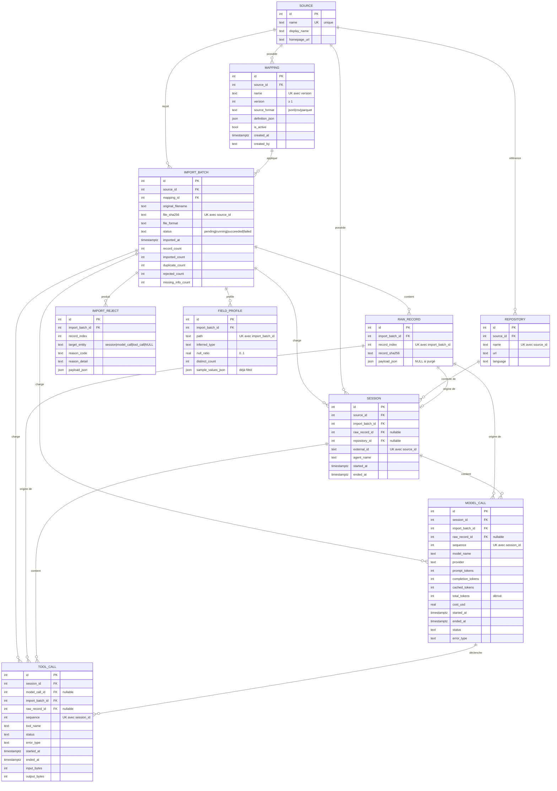

# Modèle de données — schéma relationnel v1

> Sources : entités du domaine (`backend/agentscope/domain/`, issue I1.1) + `docs/PLAN.md` §4/§5.4.
> Ce document est le contrat lu par la migration `0001` (I1.3) et par les vues du dashboard.
> Toute évolution = nouvelle migration + mise à jour de ce fichier dans la même PR (label `contract`).

## 1. Principes

- **Clé naturelle + clé technique.** Chaque table a une `id` de substitution (PK). L'identité
  métier est portée par une **contrainte d'unicité** sur la clé naturelle. Le domaine ne
  manipule que les clés naturelles ; la couche persistance fait la correspondance.
- **Provenance à deux niveaux.** Chaque fait normalisé porte `import_batch_id` (niveau import,
  *toujours* connu) **et** `raw_record_id` (ligne source exacte, *best-effort* : peut devenir
  `NULL` si les payloads bruts sont purgés — politique de rétention I1.7).
- **Temps en UTC.** Tous les instants sont `TIMESTAMPTZ`, normalisés en UTC à l'ingestion.
- **`NULL` ≠ `0`.** Une valeur absente (tokens, coût, timestamp) reste `NULL` de bout en bout ;
  les vues l'excluent des moyennes et le dashboard affiche « non disponible ».
- **Types logiques** ci-dessous → PostgreSQL / SQLite :
  `INTEGER`→`INTEGER`, `TEXT`→`TEXT`, `REAL`→`DOUBLE PRECISION`/`REAL`,
  `BOOLEAN`→`BOOLEAN`, `TIMESTAMPTZ`→`TIMESTAMPTZ`/`TEXT` ISO-8601,
  `JSON`→`JSONB`/`TEXT`.

## 2. Diagramme relationnel



## 3. Tables — ce que représente une ligne

### `source`
**Une ligne = un projet source de traces** (TraceLab, SWE-chat, Trace Commons, ou une source
ajoutée par l'utilisateur).

| Colonne | Type | Null | Notes |
| --- | --- | --- | --- |
| `id` | INTEGER | non | PK |
| `name` | TEXT | non | identifiant court, **UNIQUE** |
| `display_name` | TEXT | oui | libellé affiché |
| `homepage_url` | TEXT | oui | |

Clé naturelle : `name`.

### `repository`
**Une ligne = un dépôt de code référencé par des sessions** de cette source (cas SWE-chat).

| Colonne | Type | Null | Notes |
| --- | --- | --- | --- |
| `id` | INTEGER | non | PK |
| `source_id` | INTEGER | non | FK → `source.id` |
| `name` | TEXT | non | |
| `url` | TEXT | oui | |
| `language` | TEXT | oui | langage principal |

Clé naturelle : `(source_id, name)` **UNIQUE**.

### `mapping`
**Une ligne = une configuration de mapping enregistrée et versionnée**, qui décrit comment
transformer un format source en modèle commun. Réutilisable d'un import à l'autre.

| Colonne | Type | Null | Notes |
| --- | --- | --- | --- |
| `id` | INTEGER | non | PK |
| `source_id` | INTEGER | non | FK → `source.id` |
| `name` | TEXT | non | |
| `version` | INTEGER | non | ≥ 1 |
| `source_format` | TEXT | non | `jsonl` \| `csv` \| `parquet` |
| `definition_json` | JSON | non | document du contrat de mapping (PLAN §5.1) |
| `is_active` | BOOLEAN | non | défaut `true` |
| `created_at` | TIMESTAMPTZ | non | |
| `created_by` | TEXT | oui | |

Clé naturelle : `(name, version)` **UNIQUE**. Les mappings « intégrés » (TraceLab, SWE-chat)
sont insérés par une migration de seed.

### `import_batch`
**Une ligne = une exécution d'import d'un fichier** dans le modèle commun, avec son bilan.

| Colonne | Type | Null | Notes |
| --- | --- | --- | --- |
| `id` | INTEGER | non | PK |
| `source_id` | INTEGER | non | FK → `source.id` |
| `mapping_id` | INTEGER | non | FK → `mapping.id` |
| `original_filename` | TEXT | non | |
| `file_sha256` | TEXT | non | hash du contenu du fichier |
| `file_format` | TEXT | non | `jsonl` \| `csv` \| `parquet` |
| `status` | TEXT | non | `pending` \| `running` \| `succeeded` \| `failed`, défaut `pending` |
| `imported_at` | TIMESTAMPTZ | non | |
| `record_count` | INTEGER | oui | nb d'enregistrements lus dans le fichier |
| `imported_count` | INTEGER | non | défaut 0 |
| `duplicate_count` | INTEGER | non | défaut 0 |
| `rejected_count` | INTEGER | non | défaut 0 |
| `missing_info_count` | INTEGER | non | défaut 0 |

Clé naturelle : `(source_id, file_sha256)` **UNIQUE** → cœur de l'idempotence (§6).

### `raw_record`
**Une ligne = un enregistrement source tel que reçu**, conservé pour la provenance et un
éventuel retraitement.

| Colonne | Type | Null | Notes |
| --- | --- | --- | --- |
| `id` | INTEGER | non | PK |
| `import_batch_id` | INTEGER | non | FK → `import_batch.id`, `ON DELETE CASCADE` |
| `record_index` | INTEGER | non | position 0-based dans le fichier |
| `record_sha256` | TEXT | non | hash du payload canonicalisé |
| `payload_json` | JSON | oui | enregistrement d'origine ; `NULL` si purgé (rétention I1.7) |

Clé naturelle : `(import_batch_id, record_index)` **UNIQUE**.

### `session`
**Une ligne = une session de travail d'un agent** (un run de Claude Code, Codex, …) issue
d'une source.

| Colonne | Type | Null | Notes |
| --- | --- | --- | --- |
| `id` | INTEGER | non | PK |
| `source_id` | INTEGER | non | FK → `source.id` |
| `import_batch_id` | INTEGER | non | FK → `import_batch.id` (provenance niveau import) |
| `raw_record_id` | INTEGER | oui | FK → `raw_record.id`, `ON DELETE SET NULL` |
| `repository_id` | INTEGER | oui | FK → `repository.id` |
| `external_id` | TEXT | non | id fourni par la source, **sinon synthétisé** (sha1 des `identity.key_fields` du mapping, PLAN §5.1) |
| `agent_name` | TEXT | oui | |
| `started_at` | TIMESTAMPTZ | oui | |
| `ended_at` | TIMESTAMPTZ | oui | |

Clé naturelle : `(source_id, external_id)` **UNIQUE**.
`CHECK (ended_at IS NULL OR started_at IS NULL OR ended_at >= started_at)`.
`duration_ms` n'est **pas** stockée — calculée dans `v_session_metrics`.

### `model_call`
**Une ligne = un appel à un modèle** dans une session (un aller-retour prompt → complétion).

| Colonne | Type | Null | Notes |
| --- | --- | --- | --- |
| `id` | INTEGER | non | PK |
| `session_id` | INTEGER | non | FK → `session.id`, `ON DELETE CASCADE` |
| `import_batch_id` | INTEGER | non | FK → `import_batch.id` |
| `raw_record_id` | INTEGER | oui | FK → `raw_record.id`, `ON DELETE SET NULL` |
| `sequence` | INTEGER | non | ordre dans la session, ≥ 0 |
| `model_name` | TEXT | non | |
| `provider` | TEXT | oui | |
| `prompt_tokens` | INTEGER | oui | |
| `completion_tokens` | INTEGER | oui | |
| `cached_tokens` | INTEGER | oui | |
| `total_tokens` | INTEGER | oui | **dérivé** = `prompt + completion` (voir §7.3 E2) |
| `cost_usd` | REAL | oui | unité : dollars US |
| `started_at` / `ended_at` | TIMESTAMPTZ | oui | |
| `status` | TEXT | non | `success`\|`error`\|`timeout`\|`cancelled`\|`unknown`, défaut `unknown` |
| `error_type` | TEXT | oui | `rate_limit`\|`timeout`\|`tool_error`\|`model_error`\|`validation`\|`other` |

Clé naturelle : `(session_id, sequence)` **UNIQUE**.
`CHECK (cached_tokens IS NULL OR prompt_tokens IS NULL OR cached_tokens <= prompt_tokens)`.
`CHECK (status <> 'success' OR error_type IS NULL)`.

### `tool_call`
**Une ligne = une invocation d'un outil** (bash, édition de fichier, recherche, …) dans une
session.

| Colonne | Type | Null | Notes |
| --- | --- | --- | --- |
| `id` | INTEGER | non | PK |
| `session_id` | INTEGER | non | FK → `session.id`, `ON DELETE CASCADE` |
| `model_call_id` | INTEGER | oui | FK → `model_call.id`, `ON DELETE SET NULL` (appel déclencheur) |
| `import_batch_id` | INTEGER | non | FK → `import_batch.id` |
| `raw_record_id` | INTEGER | oui | FK → `raw_record.id`, `ON DELETE SET NULL` |
| `sequence` | INTEGER | non | ordre dans la session, ≥ 0 |
| `tool_name` | TEXT | non | |
| `status` | TEXT | non | même vocabulaire que `model_call.status` |
| `error_type` | TEXT | oui | même vocabulaire que `model_call.error_type` |
| `started_at` / `ended_at` | TIMESTAMPTZ | oui | |
| `input_bytes` / `output_bytes` | INTEGER | oui | tailles, en octets |

Clé naturelle : `(session_id, sequence)` **UNIQUE**.
`sequence` est propre à chaque type d'appel ; l'ordre chronologique inter-types de la vue
session s'appuie sur les timestamps quand ils sont disponibles.

### `import_reject`
**Une ligne = un enregistrement source rejeté** (ou une sous-partie), avec une raison
consultable et expliquée.

| Colonne | Type | Null | Notes |
| --- | --- | --- | --- |
| `id` | INTEGER | non | PK |
| `import_batch_id` | INTEGER | non | FK → `import_batch.id`, `ON DELETE CASCADE` |
| `record_index` | INTEGER | non | position dans le fichier |
| `target_entity` | TEXT | oui | `session` \| `model_call` \| `tool_call` \| `NULL` (record entier) |
| `reason_code` | TEXT | non | `unparseable_record` \| `missing_required_field` \| `transform_failed` \| `unknown_target_field` \| `duplicate_in_file` \| `schema_violation` |
| `reason_detail` | TEXT | non | message lisible (chemin du champ, valeur fautive…) |
| `payload_json` | JSON | oui | enregistrement fautif |

Index (non unique) : `(import_batch_id, record_index)` — un enregistrement peut produire
plusieurs rejets (ex. record ok mais 2 appels d'outils invalides).

### `field_profile`
**Une ligne = le profil statistique d'un champ source** observé pendant un import (calculé par
le programme, jamais par l'IA). Alimente `v_data_quality` et, réutilisé, l'agent de mapping.

| Colonne | Type | Null | Notes |
| --- | --- | --- | --- |
| `id` | INTEGER | non | PK |
| `import_batch_id` | INTEGER | non | FK → `import_batch.id`, `ON DELETE CASCADE` |
| `path` | TEXT | non | ex. `usage.input_tokens` |
| `inferred_type` | TEXT | non | `string`\|`int`\|`float`\|`bool`\|`datetime`\|`object`\|`array`\|`null` |
| `null_ratio` | REAL | non | dans `[0, 1]` |
| `distinct_count` | INTEGER | non | ≥ 0 |
| `sample_values_json` | JSON | non | échantillon **déjà passé par `SensitiveFilter`**, défaut `[]` |

Clé naturelle : `(import_batch_id, path)` **UNIQUE**.

> Le flux « analyser un fichier inconnu » (`POST /analyze`, PLAN §5.3) est **éphémère** : il
> renvoie un profil sans rien persister. `field_profile` n'est écrit que lors d'un import réel.

## 4. Vues agrégées (couche dashboard)

Ne remettent pas en cause la 3NF des tables de base ; recalculées à la volée.

| Vue | Une ligne = | Colonnes principales |
| --- | --- | --- |
| `v_session_metrics` | une session | `session_id`, `source_name`, `agent_name`, `started_at`, `duration_ms` (calc.), `n_model_calls`, `n_tool_calls`, `total_tokens`, `prompt_tokens`, `completion_tokens`, `cached_tokens`, `cache_hit_ratio`, `total_cost_usd`, `n_errors`, `import_batch_id` |
| `v_daily_activity` | un couple (source, jour) | `n_sessions`, `n_model_calls`, `n_tool_calls`, `total_tokens` — jour = `date_trunc('day', session.started_at)` ; sessions sans `started_at` exclues (et comptées à part côté qualité) |
| `v_tool_usage` | un couple (source, `tool_name`) | `n_calls`, `n_errors`, `error_rate`, `avg_duration_ms` |
| `v_data_quality` | un `import_batch` | `source_name`, `record_count`, `imported_count`, `duplicate_count`, `rejected_count`, `missing_info_count`, `completeness_ratio` (= `imported_count / record_count`), `n_profiled_fields`, `avg_null_ratio` |

Règle transverse des vues : les `NULL` sont **exclus** des sommes/moyennes, jamais convertis
en `0`. Les métriques non comparables entre sources (ex. coût absent) restent nullables et
sont signalées, pas agrégées silencieusement.

## 5. Vocabulaires contrôlés

Reflètent exactement les énumérations du domaine (`domain/value_objects.py`). Implémentés en
`CHECK` (SQLite/PG) ; option `ENUM` PostgreSQL possible plus tard.

| Champ | Valeurs |
| --- | --- |
| `import_batch.status` | `pending`, `running`, `succeeded`, `failed` |
| `model_call.status`, `tool_call.status` | `success`, `error`, `timeout`, `cancelled`, `unknown` |
| `model_call.error_type`, `tool_call.error_type` | `rate_limit`, `timeout`, `tool_error`, `model_error`, `validation`, `other`, (`NULL`) |
| `import_reject.reason_code` | `unparseable_record`, `missing_required_field`, `transform_failed`, `unknown_target_field`, `duplicate_in_file`, `schema_violation` |
| `mapping.source_format`, `import_batch.file_format` | `jsonl`, `csv`, `parquet` |

## 6. Idempotence — « réimporter le même fichier ne double pas les résultats »

1. **Niveau fichier** : `import_batch (source_id, file_sha256)` **UNIQUE**. Resoumettre les
   mêmes octets pour la même source → l'importeur renvoie le bilan de l'import existant, sans
   créer de nouvelle ligne.
2. **Niveau enregistrement** : `session (source_id, external_id)`,
   `model_call (session_id, sequence)`, `tool_call (session_id, sequence)`,
   `field_profile (import_batch_id, path)` **UNIQUE** + `INSERT … ON CONFLICT DO NOTHING`
   (**le premier import gagne**).
3. `external_id` est **synthétisé** (`sha1(source | entité | valeurs des key_fields)`) quand la
   source n'en fournit pas — stable d'un import à l'autre (PLAN §5.1 `identity.key_fields`).

Effet net : importer deux fois le même fichier → compteurs identiques, zéro ligne créée.
Couvert par le test **I7.1**.

## 7. Normalisation — analyse, conformité et exceptions assumées

### 7.1 Méthode

Chaque table de base est vérifiée en analysant les **dépendances fonctionnelles (DF)** de ses
attributs vis-à-vis de la PK technique `id` **et** de la clé naturelle (souvent composite) qui
porte le sens métier — c'est cette dernière qui rend l'analyse utile, la clé de substitution
rendant 2NF/3NF triviales par construction.

Pour chaque table :

- **1NF** — valeurs atomiques, aucun groupe répétitif.
- **2NF** — aucun attribut non-clé ne dépend d'une *partie* de la clé naturelle.
- **3NF** — aucun attribut non-clé n'est déterminé par un autre attribut non-clé (transitivité).
- **BCNF** — tout déterminant est une clé candidate.

### 7.2 Résultat par table

| Table | 1NF | 2NF | 3NF / BCNF | Écarts |
| --- | --- | --- | --- | --- |
| `source` | ✅ | ✅ | ✅ | — (clé candidate `name`) |
| `repository` | ✅ | ✅ | ✅ | — |
| `mapping` | E1 | ✅ | ✅ | `definition_json` |
| `import_batch` | ✅ | ✅ | dénorm. | E3, E6 |
| `raw_record` | E1 | ✅ | dénorm. | `payload_json`, E5 |
| `session` | ✅ | ✅ | dénorm. | E4 |
| `model_call` | ✅ | ✅ | dénorm. | E4, E2 |
| `tool_call` | ✅ | ✅ | dénorm. | E4 |
| `import_reject` | E1 | ✅ | ✅ | `payload_json` (pas de clé naturelle, index seul) |
| `field_profile` | ✅ | ✅ | ✅ | — (`null_ratio`, `distinct_count` : faits mesurés, non redondants) |

Aucune dépendance transitive **non intentionnelle**. Les écarts sont des dénormalisations
décidées ; chacune est justifiée ci-dessous avec le coût évité et son garde-fou.

### 7.3 Exceptions

Format : **règle** → *pourquoi on s'en écarte* → *coût si on ne le faisait pas* → *garde-fou*.

**E1 — Colonnes document (JSON)** · `raw_record.payload_json`, `mapping.definition_json`,
`field_profile.sample_values_json`, `import_reject.payload_json`.

- Règle (1NF) : une valeur doit être atomique.
- Écart : documents semi-structurés — enregistrement source arbitraire, contrat de mapping
  (§5.1), échantillon de valeurs.
- Coût évité : une décomposition clé-valeur (EAV) détruirait la forme d'origine (donc la
  provenance), imposerait un schéma à des données hétérogènes par nature, et rendrait toute
  relecture coûteuse.
- Garde-fou : jamais utilisées comme critère de jointure ou de filtre relationnel ; lues comme
  un tout. `payload_json` peut valoir `NULL` (rétention I1.7) sans casser de contrainte.

**E2 — `model_call.total_tokens` (colonne dérivée)**

- Règle (3NF) : pas de DF d'un non-clé (`total_tokens`) vers d'autres non-clés
  (`prompt_tokens`, `completion_tokens`).
- Écart : `total_tokens = prompt_tokens + completion_tokens` (ou `NULL` si les deux sont
  absents) est **stockée**.
- Coût évité : sans elle, `v_session_metrics`, `v_daily_activity` et tout agrégat de tokens
  recalculent la somme sur des millions de lignes à chaque requête du dashboard.
- Garde-fou : écrite une seule fois, par l'importeur, depuis la valeur calculée par le domaine
  (`TokenUsage.total_tokens`) ; un test d'intégration vérifie que la valeur stockée égale
  `prompt + completion` après import. `session.duration_ms` n'est **pas** stockée (calculée en
  vue) — on garde la liste courte.

**E3 — Compteurs de bilan de `import_batch`** · `record_count`, `imported_count`,
`duplicate_count`, `rejected_count`, `missing_info_count`.

- Règle (3NF) : agrégats des tables filles (`session`, `import_reject`, `raw_record`).
- Écart : matérialisés sur la ligne d'import.
- Coût évité : le bilan doit rester lisible **après** une purge de rétention (les lignes
  filles peuvent disparaître) et sans `COUNT(*)` sur les tables filles à chaque affichage de
  l'historique.
- Garde-fou : écrits dans la **même transaction** que l'import (UnitOfWork) ; une requête de
  reconstruction (`SELECT count(*) … GROUP BY import_batch_id`) sert de contrôle d'audit.

**E4 — `import_batch_id` sur `session` / `model_call` / `tool_call`**

- Règle (3NF) : quand `raw_record_id` est renseigné, `raw_record.import_batch_id` détermine
  `session.import_batch_id` → dépendance transitive.
- Écart : **dénormalisation assumée** — `import_batch_id` est stocké directement sur chaque
  fait normalisé.
- Coût évité : (a) `raw_record_id` est **nullable** (best-effort sous rétention `minimal` ou
  purge) — sans colonne dédiée, on perdrait le rattachement niveau import dès qu'un payload
  est purgé, et `ON DELETE SET NULL` orphelinerait le fait ; (b) filtrer « les sessions de cet
  import » (panneau qualité, drill-down) sans `JOIN raw_record` intermédiaire.
- Garde-fou : invariant **`fait.import_batch_id = raw_record.import_batch_id` dès que
  `raw_record_id IS NOT NULL`**, garanti par l'unique writer (les repositories résolvent les
  deux FK depuis le même `ImportBatch`) et couvert par
  `tests/integration/test_repositories.py::test_full_import_preserves_relations`.

**E5 — `raw_record.record_sha256` (digest du payload)**

- Règle (3NF) : quand `payload_json` est présent,
  `record_sha256 = sha256(canonical(payload_json))` → dérivable.
- Écart : le hash est stocké séparément.
- Coût évité : c'est **le seul identifiant qui survit à la purge du payload** (rétention
  `minimal`) ; il sert à la détection de doublons intra-fichier (`duplicate_in_file`) sans
  réhacher, et à vérifier l'intégrité d'une récupération d'extrait.
- Garde-fou : calculé à l'ingestion sur une forme canonicalisée ; quand les deux colonnes sont
  présentes, l'égalité est un invariant d'écriture.

**E6 — `import_batch.file_format` vs `mapping.source_format`**

- Règle (3NF) : `import_batch.mapping_id → mapping.source_format`, et `file_format` devrait
  valoir la même chose → redondance transitive.
- Écart : `import_batch.file_format` enregistre le format **observé** du fichier téléversé,
  indépendamment de ce que le mapping attend.
- Coût évité : tracer ce qui a réellement été lu (provenance) ; afficher le format dans
  l'historique sans joindre `mapping`.
- Garde-fou : un écart `file_format ≠ mapping.source_format` est une **condition de rejet** de
  l'import (`reason_code = schema_violation`, I2.13), pas un état permis en base.

### 7.4 BCNF

Toutes les tables de base sont en BCNF : le seul déterminant de chaque table est sa clé (PK
technique et/ou clé naturelle `UNIQUE`) — aucun déterminant non-clé. Les dénormalisations
E2–E6 introduisent des DF `non-clé → non-clé` **contrôlées** par un invariant d'écriture, pas
un nouveau déterminant.

### 7.5 Les vues ne sont pas normalisées — et c'est voulu

`v_session_metrics`, `v_daily_activity`, `v_tool_usage`, `v_data_quality` (§4) sont la
**couche de lecture dénormalisée** du dashboard : agrégats, ratios, comptages pré-joints,
recalculés à la volée. Les tables de base restent la source de vérité normalisée. Hors E2/E3,
aucune donnée du dashboard n'est stockée en double de façon persistante.

## 8. Unités et valeurs manquantes

- Tokens : entiers. Coût : `cost_usd`, **dollars US**, `REAL`. Durées : suffixe `_ms`,
  **millisecondes**, calculées. Instants : `TIMESTAMPTZ`, **UTC**.
- Une donnée non fournie par la source reste `NULL` sur toute la chaîne (table → vue → API →
  UI). Le dashboard affiche « non disponible » ; jamais `0`.

## 9. Provenance et rétention

- `raw_record` conserve le payload d'origine **par défaut**.
- Sous forte volumétrie (I1.7), une politique de rétention peut ne garder que
  `record_sha256` + les payloads des rejets. Les FK `raw_record_id` passent alors à `NULL`
  (`ON DELETE SET NULL`) ; `import_batch_id` reste renseigné, la traçabilité niveau import est
  préservée.

## 10. Correspondance entités du domaine ↔ tables

| Entité (`agentscope.domain`) | Table | Clé naturelle |
| --- | --- | --- |
| `Source` | `source` | `name` |
| `Repository` | `repository` | `(source, name)` |
| `SourceMapping` | `mapping` | `(name, version)` |
| `ImportBatch` | `import_batch` | `(source, file_sha256)` |
| `RawRecord` | `raw_record` | `(import_batch, record_index)` |
| `Session` | `session` | `(source, external_id)` |
| `ModelCall` | `model_call` | `(session, sequence)` |
| `ToolCall` | `tool_call` | `(session, sequence)` |
| `ImportReject` | `import_reject` | — (index `(import_batch, record_index)`) |
| `FieldProfile` | `field_profile` | `(import_batch, path)` |
| `FieldProfileSet` | *(non persistée)* | agrégat en mémoire ; `record_count` vit sur `import_batch` |

Le domaine calcule (`TokenUsage.total_tokens`, `Interval.duration_ms` en propriétés) ; l'ORM
persiste la valeur calculée quand la colonne existe (`model_call.total_tokens`) — pour les
agrégats SQL uniquement — et la propriété reste la source de vérité côté code.

## 11. Annexe — DBML (dbdiagram.io)

```dbml
Table source {
  id int [pk, increment]
  name text [not null, unique]
  display_name text
  homepage_url text
}

Table repository {
  id int [pk, increment]
  source_id int [not null, ref: > source.id]
  name text [not null]
  url text
  language text
  Indexes { (source_id, name) [unique] }
}

Table mapping {
  id int [pk, increment]
  source_id int [not null, ref: > source.id]
  name text [not null]
  version int [not null]
  source_format text [not null]
  definition_json json [not null]
  is_active boolean [not null, default: true]
  created_at timestamptz [not null]
  created_by text
  Indexes { (name, version) [unique] }
}

Table import_batch {
  id int [pk, increment]
  source_id int [not null, ref: > source.id]
  mapping_id int [not null, ref: > mapping.id]
  original_filename text [not null]
  file_sha256 text [not null]
  file_format text [not null]
  status text [not null, default: 'pending']
  imported_at timestamptz [not null]
  record_count int
  imported_count int [not null, default: 0]
  duplicate_count int [not null, default: 0]
  rejected_count int [not null, default: 0]
  missing_info_count int [not null, default: 0]
  Indexes { (source_id, file_sha256) [unique] }
}

Table raw_record {
  id int [pk, increment]
  import_batch_id int [not null, ref: > import_batch.id]
  record_index int [not null]
  record_sha256 text [not null]
  payload_json json
  Indexes { (import_batch_id, record_index) [unique] }
}

Table session {
  id int [pk, increment]
  source_id int [not null, ref: > source.id]
  import_batch_id int [not null, ref: > import_batch.id]
  raw_record_id int [ref: > raw_record.id]
  repository_id int [ref: > repository.id]
  external_id text [not null]
  agent_name text
  started_at timestamptz
  ended_at timestamptz
  Indexes { (source_id, external_id) [unique] }
}

Table model_call {
  id int [pk, increment]
  session_id int [not null, ref: > session.id]
  import_batch_id int [not null, ref: > import_batch.id]
  raw_record_id int [ref: > raw_record.id]
  sequence int [not null]
  model_name text [not null]
  provider text
  prompt_tokens int
  completion_tokens int
  cached_tokens int
  total_tokens int
  cost_usd real
  started_at timestamptz
  ended_at timestamptz
  status text [not null, default: 'unknown']
  error_type text
  Indexes { (session_id, sequence) [unique] }
}

Table tool_call {
  id int [pk, increment]
  session_id int [not null, ref: > session.id]
  model_call_id int [ref: > model_call.id]
  import_batch_id int [not null, ref: > import_batch.id]
  raw_record_id int [ref: > raw_record.id]
  sequence int [not null]
  tool_name text [not null]
  status text [not null, default: 'unknown']
  error_type text
  started_at timestamptz
  ended_at timestamptz
  input_bytes int
  output_bytes int
  Indexes { (session_id, sequence) [unique] }
}

Table import_reject {
  id int [pk, increment]
  import_batch_id int [not null, ref: > import_batch.id]
  record_index int [not null]
  target_entity text
  reason_code text [not null]
  reason_detail text [not null]
  payload_json json
  Indexes { (import_batch_id, record_index) }
}

Table field_profile {
  id int [pk, increment]
  import_batch_id int [not null, ref: > import_batch.id]
  path text [not null]
  inferred_type text [not null]
  null_ratio real [not null]
  distinct_count int [not null]
  sample_values_json json [not null, default: '[]']
  Indexes { (import_batch_id, path) [unique] }
}
```
